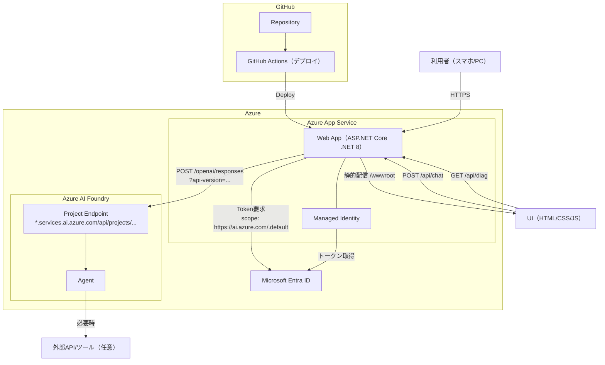

# 壁打ちAIエージェント（v0.1.6）

ビジネスプラン壁打ちWebアプリケーション

## 概要

壁打ちAIエージェントは、ビジネスプランのアイデアを整理し、検証するための壁打ち（ブレインストーミング）支援Webアプリケーションです。
AIを活用して、ビジネスアイデアに対するフィードバックや質問を提供し、計画の精度を高めることを目指します。

## 技術スタック

- **バックエンド**: .NET 8 WebAPI
- **フレームワーク**: ASP.NET Core

## プロジェクト構成

```text
Kabeuchi-AI/
├── KabeuchiAI/          # .NET 8 WebAPI プロジェクト
├── .github/
│   └── workflows/       # GitHub Actions CI/CD
└── README.md
```

## 構成図（デプロイ）



## 今後の予定（ロードマップ）

実装の優先順位は「ユーザーが迷わず使い始められる → 価値の出る機能を増やす → 認証/セキュリティ/運用基盤を固める → 利用状況を見える化して改善サイクルを回す」の順で進めます。

### 1) すぐに体験価値を上げる（短期）

- 最初によくある質問（FAQ）を4つ程度パネル化し、ワンクリックで壁打ち開始
  - 入力のハードルを下げて初回体験を改善
- UI/UXの改善
  - モバイル中心で「迷わない・押しやすい・読みやすい」を優先
- 壁打ち結果のエクスポート（最終的に人間が仕上げできるフォーマット）
  - 例: Markdown / PDF / 指定テンプレ（項目見出し固定）など

### 2) 思考整理の“見える化”とフィードバック強化（中期）

- ビジネスプラン全体の進捗が分かるビュー
  - 例: 事業概要/顧客/課題/解決策/競合/収益/実行計画…の充足度を可視化
- 特定のビジネスコンテスト向けフィードバック
  - 仕様書や評価観点（審査項目）を入力/選択できるようにし、その観点で質問・改善点を返す

### 3) アカウント・運用基盤を整備（中長期）

- 認証機能
  - まずは「ログインして履歴を保存できる」状態を目標
- セキュリティの改善
  - 認証導入に合わせて、レート制限・入力検証・ログの取り扱い・秘密情報の保護を強化
- GitHub Actionsに脆弱性チェック等を追加
  - 依存関係の脆弱性検知、静的解析、セキュリティスキャンを自動化

### 4) 改善サイクル（計測と分析）（中長期）

- どういったユーザーがどれくらい使ったかを把握する機能
  - 認証後の利用状況（匿名/個別）や、機能別利用率を可視化して継続改善に繋げる

## ライセンス

MIT License（[LICENSE](LICENSE)）

## 貢献

TBD

## バージョン履歴

- v0.1.6
  - UI改善（ヘッダー配置、入力ヒント、クイック開始見出し、考え中アニメーション）
- v0.1.5
  - UI改善（クイック開始ボタンの可読性、入力ヒント表示、考え中表示の強化）
- v0.1.4
  - UI調整（キャンセル削除、クイック開始ボタンの表記整理）
- v0.1.3
  - UI改善（FAQ、エクスポート、新規チャット、キャンセル）
  - バージョン表記の扱いを改善
- v0.1.1
  - README のタイトル変更とバージョン表記を追加
- v0.1.0
  - Foundry Agent を呼び出してレスポンスを返せる状態に到達
  - モバイル表示の改善（チャットUIを画面下部/ビューポートに固定）
